<h1 align="center">Ballast</h1>
<p align="center"><b>A stress and workload manager for students who are already too busy to manage their stress.</b></p>
<p align="center">
  <a href="https://load-balancer-ballast.expo.app"><b>▶ Open the live prototype</b></a> ·
  CodeNection · Lifestyle Track: Beating the Burnout
</p>

<p align="center">
  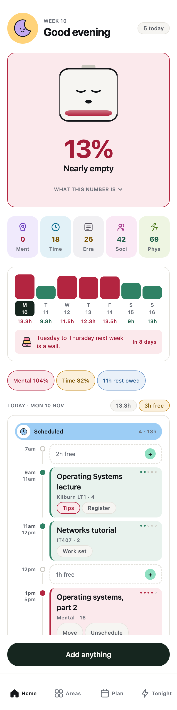
  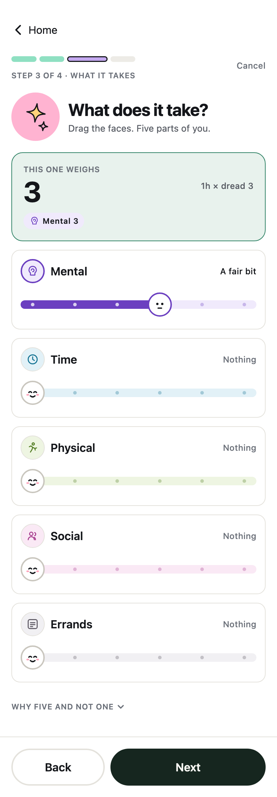
  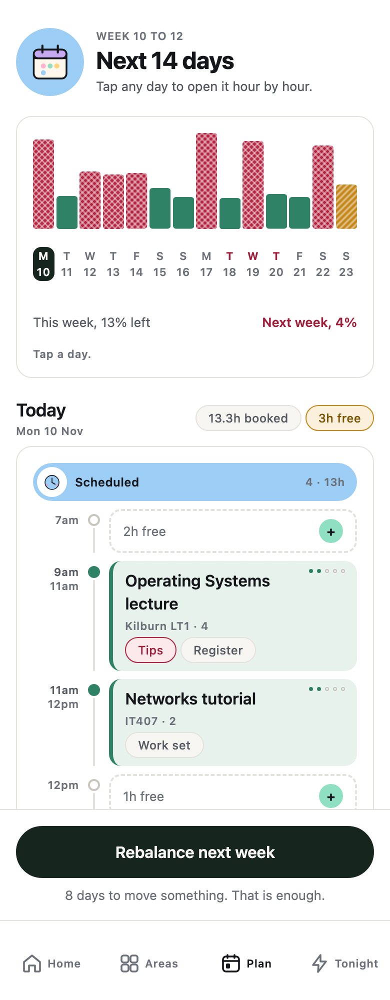
</p>

---

## 1. Project Overview

### The problem

Burnout is almost never one big thing. It is a pile of small ones nobody was counting, and by the time a
student can feel it, the week that caused it is already over.

We kept coming back to six reasons why.

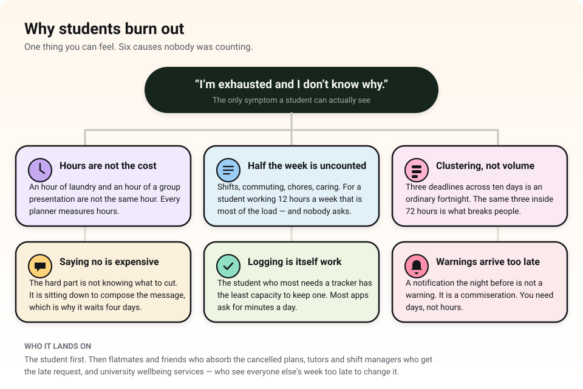

### What already exists, and where it stops

| App | What it does well | Why it does not solve this |
|---|---|---|
| **Forest** | A charming Pomodoro timer. A tree dies if you leave the app. | It treats distraction as the problem. A student drowning in coursework is not distracted — they are overcommitted. |
| **Study Bunny** | Timer, coins, a rabbit you dress up. Genuinely fun. | It rewards time *spent studying*. It cannot tell you that studying more tonight is the wrong move. |
| **Notion · Todoist · Google Calendar** | Excellent at lists and blocks of time. | Every task weighs the same. A full calendar looks identical to a survivable one. |
| **Mood journals** | Good at noticing a pattern. | They describe the week. They change nothing about it. |

> Not one of them can say: **"Next Wednesday is going to hurt, and here are three things you could put down."**
> That sentence is the whole product.

### Our solution

Ballast measures a task as **time × dread**, because an hour you are dreading costs more than an hour you
are not. One task can land in several of five areas at once — a group presentation is not just "mental",
it is mental *and* time *and* a social cost nobody would have thought to name. So the app can see **which
part of you** is overflowing, not only how full you are.

Then it looks fourteen days ahead, finds the pile-up **before** it arrives, and offers specific things you
could put down — including writing the awkward message for you.

It runs entirely on the phone. The daily ask is one tap.

---

## 2. Ideation & Process

### 2.1 Ideas we considered

We started with eight. Four are in the app. We killed four on purpose, and the reasons mattered more than
the ideas did.

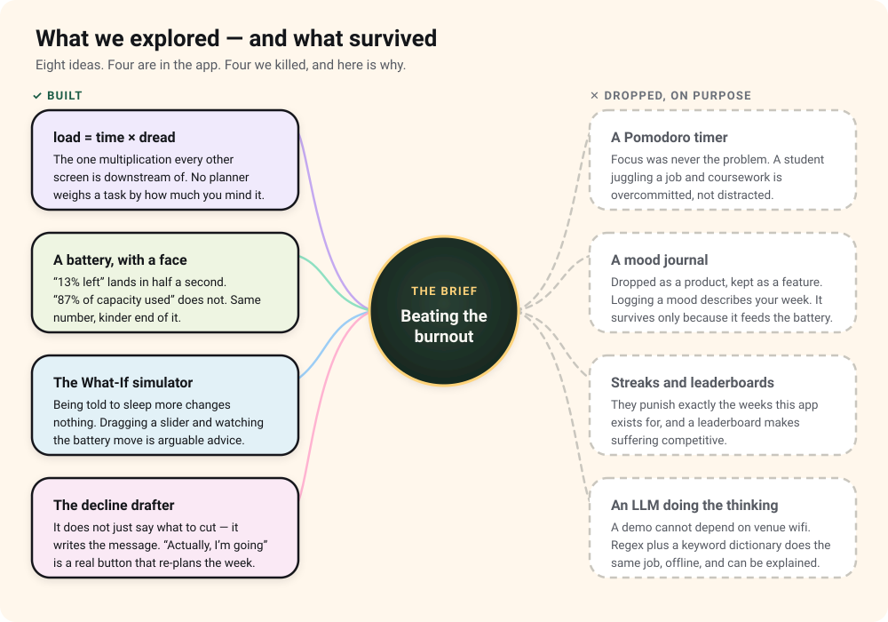

### 2.2 How the app is meant to be used

Every box below is a screen you can open in the prototype right now.

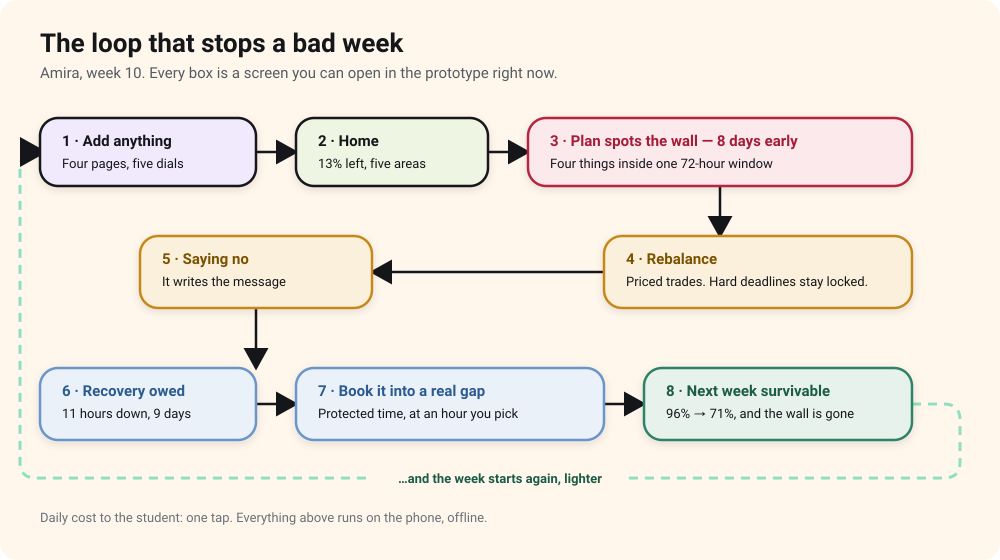

### 2.3 Mentor consultation

| Date | Mentor | Feedback received | What we changed |
|---|---|---|---|
| | | | |
| | | | |

> *To be completed by the team from our own mentor sessions.*

---

## 3. Design & Prototype

### ▶ [load-balancer-ballast.expo.app](https://load-balancer-ballast.expo.app) — live, no install, no sign-in

Every number on every screen is worked out from a seeded fictional semester. Nothing below is a mock-up or
a pasted-in figure: change a task and the forecast changes with it.

---

### 3.1 Add anything — five dials, four short pages

<table>
<tr>
<td width="36%">

</td>
<td>

Adding a task is where every planner loses people, because it looks like a form. Ours is **four pages with
one question each**, and you can see how many are left.

- **A drawing to start from.** Tap *Assignment*, *Shift*, *Gym* or *See people* and the page fills itself in.
- **Five dials, not one number.** Instead of "how hard is this, 1–5", you say how much it takes out of your
  head, your hours, your body, your social life and your admin — by dragging a little face that gets more
  overwhelmed as you push it.
- **The maths stays honest.** The total is still `hours × dread`, where dread is the **worst** area, not the
  sum. Three areas at "a fair bit" is not three times worse than one — it is the same weight, landing in
  three places.
- **Spreading a load reads lower, and that is correct.** Your overall reading is `(average + worst) ÷ 2`,
  so a task that hammers one area is more dangerous than one spread thin. That is the app's whole argument,
  now available the moment you write something down.
- **Nobody has to learn the scale.** You can read the faces without reading the labels.

</td>
</tr>
<tr>
<td>
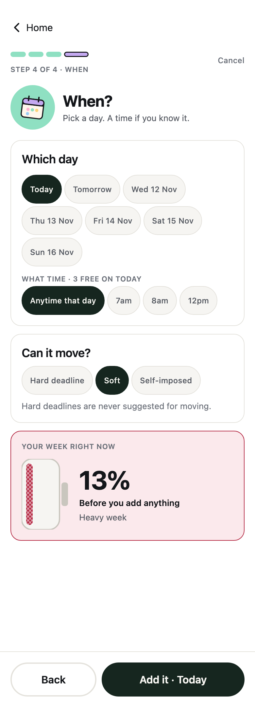
</td>
<td>

**Page four shows you the damage before you agree to it.** Pick a day and an hour from the gaps that
actually exist in your week, and the battery underneath updates to what your week will read *if you add
this*. Nothing is saved until you press the button.

</td>
</tr>
</table>

---

### 3.2 Owing — assignments that stop hiding until the night before

<table>
<tr>
<td width="36%">
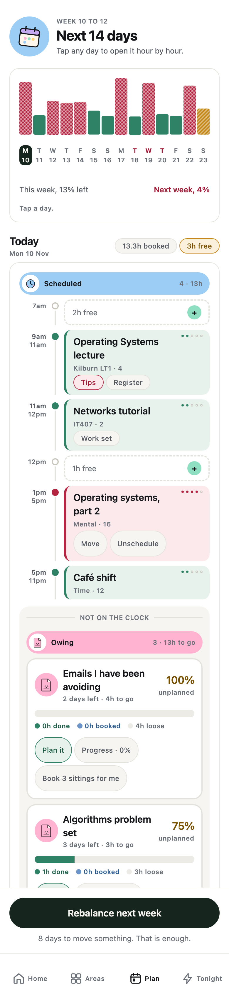
</td>
<td>

A deadline is not a task. An assignment due Thursday is nine hours spread across the days *before*
Thursday — and a normal to-do list shows you nothing until Thursday, which is exactly why it ruins the
night before.

So a day is split into three honest bands:

- **Scheduled** — things with a time, drawn on a clock rail so the gaps between them are real space you can
  tap to fill.
- **Owing** — work due later that you have not finished. It sits on **every** day until it is done.
- **This day** — loose tasks and errands with no time yet.

Each Owing card carries a **three-state progress bar**: hours done, hours booked into a day, and hours
still loose. Booking a sitting moves work out of "loose" even though none of it is finished yet — because
a plan is progress. Give the sitting back and it goes straight into "loose" again.

- **Set progress by percent, 0–100.** "I'm about 75% through" is how people actually think.
- **Each sitting takes a note** — *"finish section 2"* — so you do not lose ten minutes remembering where
  you were.
- **The card warns before it is too late.** If the free hours left before the deadline no longer cover the
  hours owed, the card turns red and says *"Not enough free time left. Something has to move."*
- **Push today's sitting to tomorrow** in one tap. The work moves; **the deadline never does.**

</td>
</tr>
</table>

> ### 📌 "Book my sittings for me"
>
> The part we are proudest of. Press it and the planner reads your real week — classes, shifts, recovery,
> everything already booked — and spreads the hours you still owe across the **lightest days before the
> deadline**: two hours at a time, never more than one sitting a day, never on top of something else, and
> never before the hour you said your day is your own.
>
> It shows you what it is about to do **before** it does it, including the hours it **cannot** fit —
> *"3h will not fit before the deadline."* Most planners let you find that out on Wednesday night.
>
> It is a real scheduling algorithm, not a language model, which is why it also works on the bus with no
> signal. [Why we chose that →](#54-why-the-planner-is-an-algorithm-and-not-an-llm)

---

### 3.3 Tonight — plan an evening around what *you* actually do

<table>
<tr>
<td width="36%">
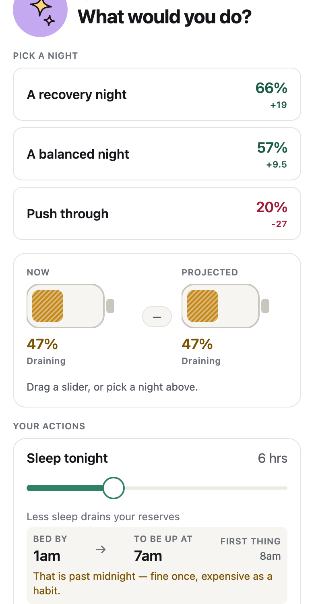
</td>
<td>

Every other screen reports what already happened. This one is the part of the day you have not lived yet.
Three pages: **which night → what you'd do → book it.**

- **Pick a kind of night, not a dial.** *A recovery night* lands you at 32%. *Push through* lands you at 0%.
  You can see the cost of both before choosing.
- **Then adjust anything.** Sliders for sleep, a walk, texting a friend, a study session, late-night screen
  time — each one showing what it gives back or takes away, live.
- **Add your own hobbies.** Badminton, a night run, choir, band practice. Type it once with a usual length
  and it becomes a permanent slider on your own screen. The five we ship are a starting point, not a claim
  about your life.
- **Sleep says *when*, not just *how long*.** Six hours is fine or impossible depending on when tonight
  finishes, so it tells you the bedtime it implies and whether your evening actually allows it: *"Tonight
  runs to 11pm, so 6h is not available."*
- **Your evening starts when you say.** Set the hour your day becomes yours and nothing is ever booked
  before it.
- **Booking writes real protected blocks** at hours you can change, and you can clear the whole evening
  and start again.

</td>
</tr>
</table>

---

### 3.4 Timetable — import it, then mark the lectures that matter more

<table>
<tr>
<td width="36%">
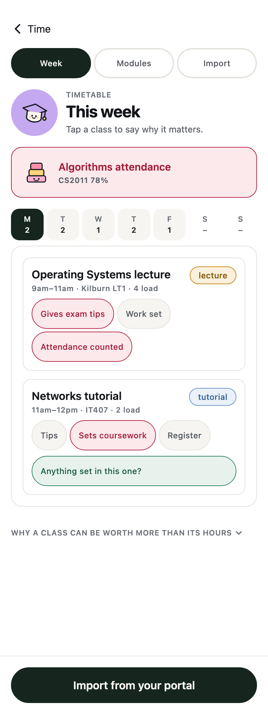
</td>
<td>

Fourteen hours of class a week is the biggest single thing in a student's life, and most planners either
ignore it or make you type it in twice.

- **Paste it from your portal.** Any shape works — `Mon 09:00-11:00 CS2040 … Kilburn LT1`, `Thu 8-10am`,
  `in Lab A`. **A line it cannot read is handed back on screen, never dropped**, so nothing disappears quietly.
- **Mark why an hour matters.** A lecture is an hour of load like any other **until it is the one where the
  exam hints get given**. Three flags say so:

  | Flag | What it actually changes |
  |---|---|
  | **Gives exam tips** | The rebalancer will never propose moving it — it appears **locked**, like a hard deadline |
  | **Sets coursework** | Adds *"Anything set in this one?"*, so work gets captured the minute it is announced |
  | **Attendance counted** | Feeds the register and warns you **before** you cross the line |

- **Attendance warnings that arrive early.** *"One more absence takes you under 80%."* Modules with no
  attendance policy claim nothing.

</td>
</tr>
<tr>
<td>
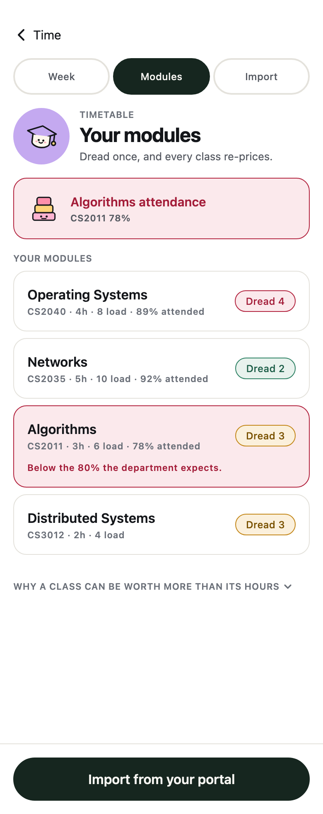
</td>
<td>

**Dread belongs to the module, not the class.** You do not dread Tuesday — you dread networks. Set it once
and **every class in that module re-prices**, which is the only way to get an honest number without asking
you to rate fourteen contact hours one at a time.

Each module also shows what it is costing you: *Networks · 5h · 10 load · 92% attended.*

</td>
</tr>
</table>

---

### 3.5 Friends — see who has room before you ask

<table>
<tr>
<td width="36%">
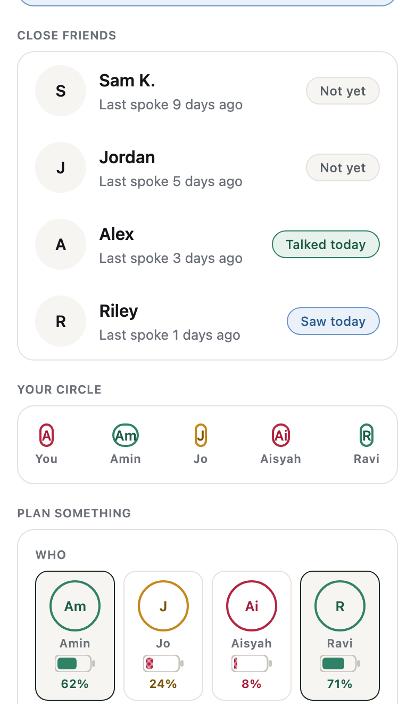
</td>
<td>

The reason people stop seeing their friends in week 10 is not motivation. It is **coordination** between
four people who are all quietly assuming everyone else is busier than they are.

- **Everyone's battery, next to their name.** Inviting the person sitting at 8% to a day trip is not a
  kindness, and now you can see that before you ask.
- **Shared free time, worked out for you.** Pick who and what — dinner, a walk, study together, a day trip —
  and it intersects **their** free evenings with the real gaps in **your** week and offers only the windows
  that work for everybody.
- **Sending it books it.** The gathering lands in your own week as social load, with a real time on it, so
  it is counted like everything else rather than being a nice idea you forget.
- **Quiet care, no nagging.** If someone has been in the red for days, you get one line — *"Jo has been heavy
  for 6 days"* — with no prompt and no script. And a **low-effort reconnection** suggestion for whoever you
  have not spoken to longest, because a two-line text is a realistic ask in a heavy week and a coffee is not.
- **Privacy by design.** Friends see a **band** — steady, busy, heavy — never your numbers, your tasks or
  your calendar.

</td>
</tr>
</table>

---

### 3.6 The battery, and the five areas under it

<table>
<tr>
<td width="36%">
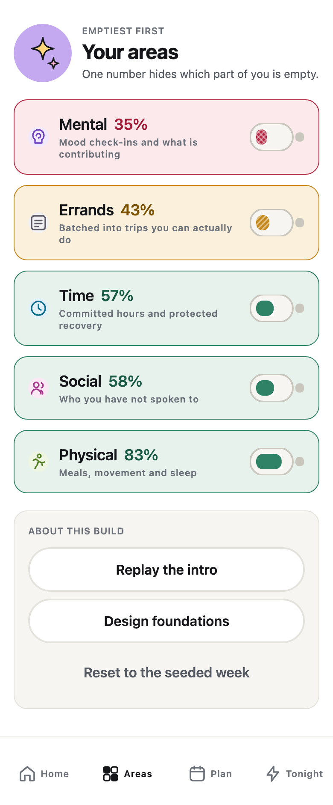
</td>
<td>

One number is easy to read and easy to be wrong about. Ballast shows one — with a face, so you can read
your week before you read anything at all — and then immediately shows what it is made of.

- **Five areas, five separate ceilings.** Mental, time, physical, social, errands. Someone at 60% overall
  with mental at 100% is closer to the edge than someone sitting evenly at 75%, and `(average + worst) ÷ 2`
  says so.
- **The character never scolds you.** There is no frown at any level. At 8% it is a companion who is also
  tired, not a judge.
- **Each area logs what it is actually made of** — a mood grid, a week grid, meals and sleep, contact gaps,
  batched errands. A generic task list would tell you none of it.
- **The one input that puts charge back.** Log something good — *properly laughed*, *finished something*,
  *actually rested* — and the battery goes **up**. It is the only reward in the app, it only fires for
  something you did, and repeating the same thing tails off so it stays honest.

</td>
</tr>
</table>

---

### 3.7 Plan, Rebalance and Saying no — the part that prevents something

<table>
<tr>
<td width="36%">
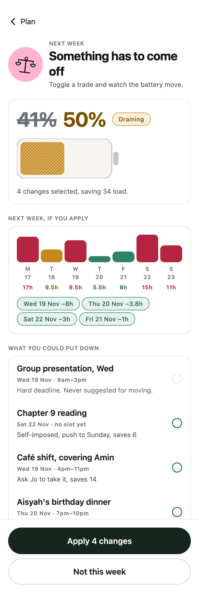
</td>
<td>

**Plan** slides a 72-hour window across the next fortnight and flags **density, not volume** — four things
inside three days is a wall, however light the fortnight looks on average. It warns **eight days out**,
which is long enough to email a tutor or swap a shift.

**Rebalance** then prices what you could put down. Every row says what it saves and which day and hour it
touches; the battery moves as you toggle. **Hard deadlines cannot be toggled at all** — they are listed and
locked, because an app that suggests skipping your exam is an app you stop trusting. Apply, and it tells you
whether the wall is actually gone.

</td>
</tr>
<tr>
<td>
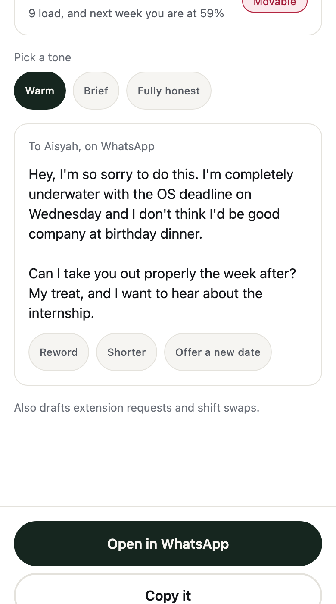
</td>
<td>

**Saying no** is the twist. Knowing what to cut was never the hard part — writing the message is, which is
why it waits four days. So the app writes it, in three tones, and you edit it before it goes anywhere.

**It never sends anything.** And *"Actually, I'm going"* is a first-class button that re-plans the week
around your choice instead of guilt-tripping you.

</td>
</tr>
</table>

---

### 3.8 Built for the worst day, not the demo day

<table>
<tr>
<td width="36%">
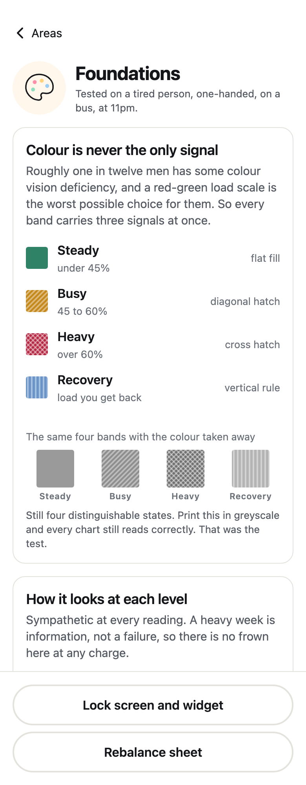
</td>
<td>

- **Above 90%, the app gets simpler.** One number, one sentence, one button. Most apps add urgency when
  things get bad. That is backwards.
- **Colour is never the only signal.** Every band is a colour **and** a word **and** a fill pattern. Print
  it in greyscale and all four states stay readable.
- **Every chart can be spoken.** Screen readers get a real sentence, not a label.
- **44pt targets, 200% dynamic type, reduced motion.** Nothing truncates; rows reflow.
- **No streaks, no scores, no leaderboards.** They punish exactly the weeks this app exists for.

</td>
</tr>
</table>

### 3.9 The rest of it

<p align="center">
  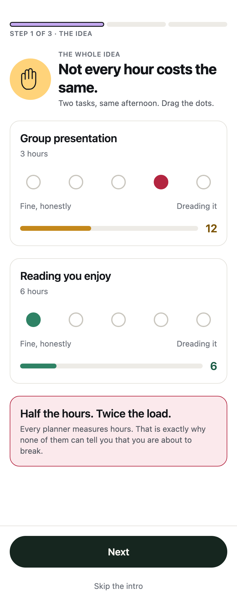
  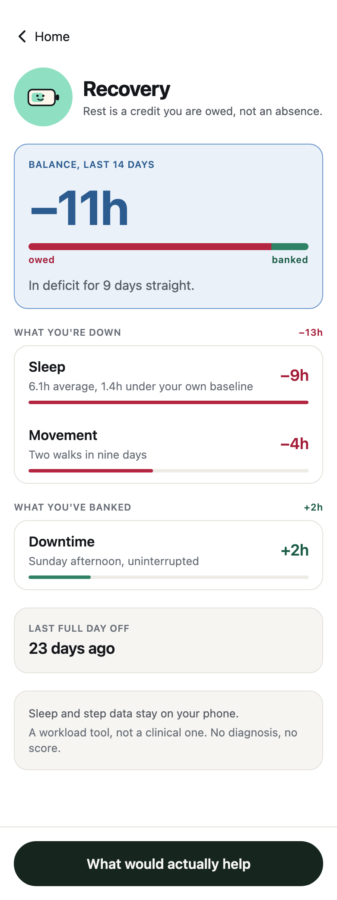
  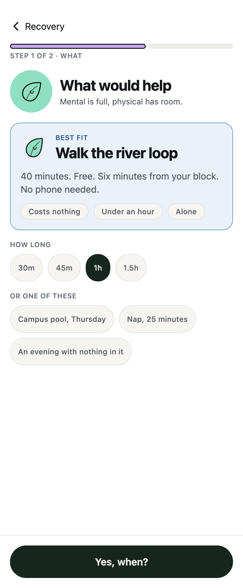
  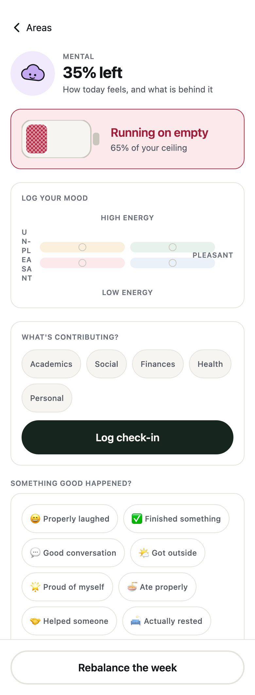
  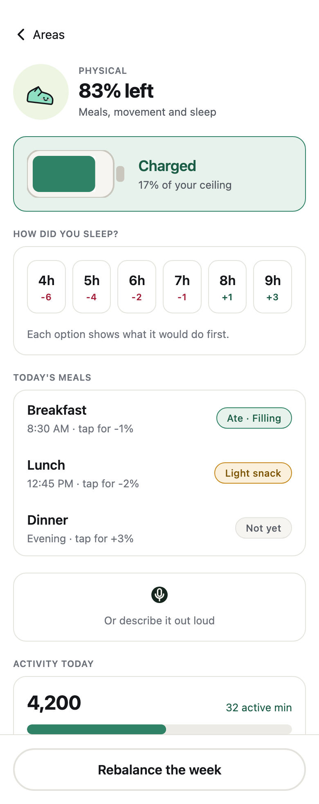
</p>
<p align="center">
  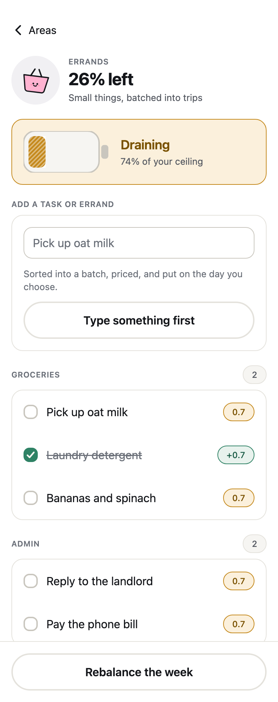
  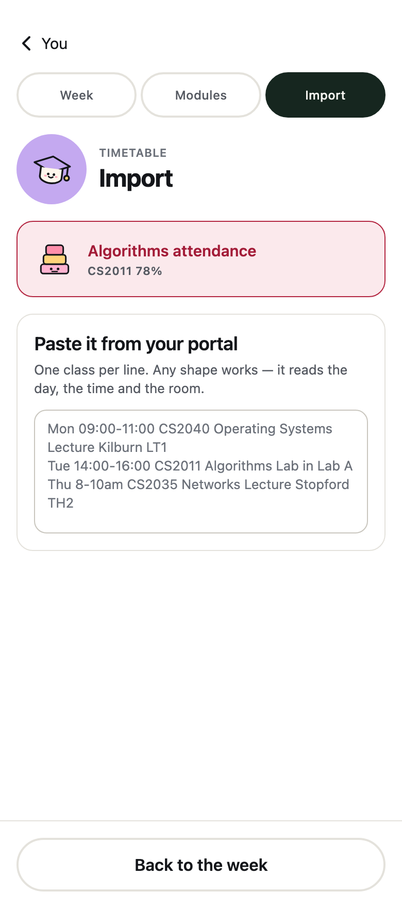
  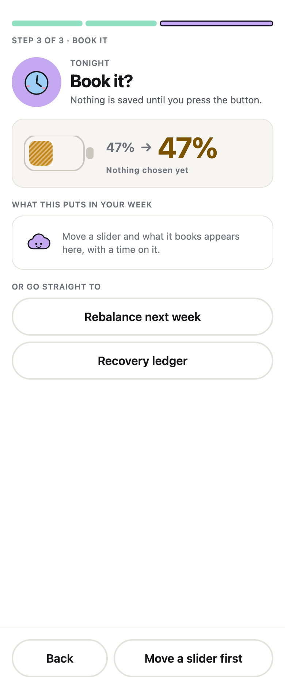
  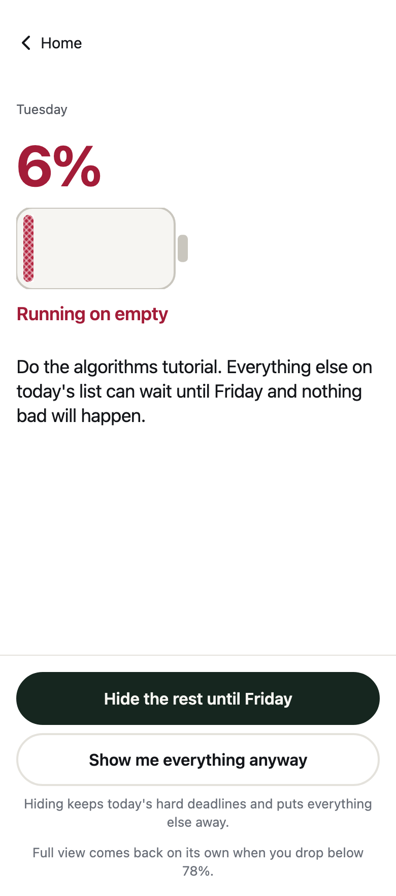
  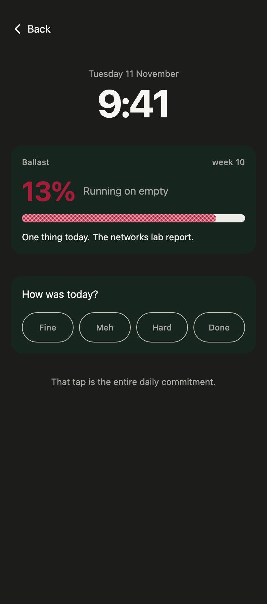
</p>
<p align="center"><i>The intro · the recovery ledger · matched rest · mood · body · errands · timetable import · booking a night · calm mode · the lock screen</i></p>

---

All 27 screens export to Figma in one import — `npm run figma:canvas` builds a single page of 390×844
artboards, and `figma/tokens.json` imports as Figma variables.

---

## 4. What Makes It Different

| # | Feature | Why nothing else does this |
|---|---|---|
| 1 | **load = hours × dread** | No planner weighs a task by how much you mind it. One tap at capture, and it is why the app can tell two identical-looking weeks apart. Three hours of group presentation (12) outweighs six hours of reading you enjoy (6). |
| 2 | **One task, five areas** | Every other planner files a task under one heading. We ask how much it takes out of each of the five, with a dial and a face instead of a number — so the load lands where it actually costs you, and the rest we suggest changes with it. |
| 3 | **Work that is owing, not work that is today** | Assignments sit on every day until done, with done / booked / loose tracked separately, and the sittings planned across your lightest days automatically. A to-do list shows you nothing until the night it ruins. |
| 4 | **Clustering detection, not totals** | Everything else warns on volume. We slide a 72-hour window across the fortnight, ignore repeating background load, and flag density — eight days early, while you can still do something. |
| 5 | **The decline drafter** | The app does not just say what to cut. It writes the message, in three tones, and never sends it. *"Actually, I'm going"* re-plans around your choice. |
| 6 | **Recovery in the same units as work** | Rest is a credit you are owed, in hours, carried forward — not an absence. Booking it writes protected time at an hour you pick from gaps that really exist. |
| 7 | **Your friends' capacity, not their calendar** | You see a band, never a number, and the app finds the evening that works for all of you. Nothing else tells you *who has room* before you ask. |
| 8 | **Classes marked for *why* they matter** | A lecture is just an hour until it is the one giving exam hints. Flag it and the rebalancer refuses to move it — visibly, listed and locked. It is the first thing a stressed student drops and the last they can afford to. |
| 9 | **The interface gets simpler as the week gets worse** | Above 90% it collapses to one number, one sentence, one button. |
| 10 | **Game feel without game pressure** | A character on the battery, a drawing on every screen, a face on every dial — and no streak, no score, no leaderboard. It is sympathetic at 8% as well as 80%. |

---

## 5. Technical Architecture & Feasibility

### 5.1 What is running today

The prototype is a complete, working front end. No screen is a mock-up, and every figure is computed.

| Layer | Choice | Why, and what we accept |
|---|---|---|
| **App** | Expo SDK 57 · React Native 0.86 · React 19.2 | One codebase for iOS, Android and web. A judge opens it from a QR code or a link. **Trade-off:** Expo Go in the App Store lags the SDK, so we pin versions deliberately. |
| **Language** | TypeScript 6, `strict` | Area, dread and commitment are union types, so an impossible week does not compile. |
| **Routing** | Expo Router 57 | File-based, so the route tree *is* the screen list. A broken link fails at compile time. |
| **Styling** | NativeWind 4 + Tailwind 3.4 | The Tailwind theme is generated from `figma/tokens.json`, so a class name and a Figma variable are the same decision. Arbitrary values cannot be written. |
| **State** | Zustand 5 | The model is small, local and synchronous. No provider tree, no cache layer. |
| **Charts** | Hand-built on `react-native-svg` | **Deliberately not a chart library.** A library draws to an opaque canvas; ours are real shapes that carry a fill pattern for colour-blind users and a spoken sentence for screen readers — and they paste into Figma as vectors. |
| **Storage** | AsyncStorage, on device | Works in a basement lecture theatre. **Trade-off:** no sync yet, which §5.2 fixes. |
| **Web hosting** | EAS Hosting | `npm run deploy` runs the full check suite first and refuses to publish if anything fails. |

### 5.2 How we would build the real thing

The prototype was built local-first on purpose, and that decision carries all the way into production: the
phone stays the source of truth, and the server is a synchroniser, not a dependency. The app must keep
working with no signal.

| Layer | Choice for v1 | What it is for |
|---|---|---|
| **Backend** | **Supabase** (managed Postgres + Auth + Realtime + Storage + Edge Functions) | One managed service covers database, auth, realtime and scheduled jobs. A three-person student team can run it; a self-hosted Node + Postgres stack is the fallback if we outgrow it. |
| **Database** | **PostgreSQL** | Tables: `users`, `items`, `modules`, `sessions`, `recovery`, `logs`, `friendships`, `invites`, `ceilings`. Every row carries `user_id` and `updated_at`. |
| **Access control** | **Row-Level Security**, on every table | A user can only ever read or write rows where `user_id = auth.uid()`. Friend visibility is a separate, deliberately thin view — see below. |
| **API** | **PostgREST** (auto-generated REST) + **Realtime** channels | No hand-written CRUD. Anything with real logic — the clustering detector, invite fan-out, push scheduling — becomes a typed **Edge Function** (Deno) so the rules live in one place and the client cannot be the only thing enforcing them. |
| **Sync** | Local-first queue, last-write-wins per row on `updated_at` | Writes land in Zustand and AsyncStorage immediately, then drain to the server when there is signal. Conflicts are per-row, not per-document, so two devices editing different tasks never collide. |
| **Auth** | Supabase Auth — university email magic link, plus Apple and Google sign-in | Magic link avoids storing passwords. Apple sign-in is required for App Store release anyway. |
| **Friends** | A `friend_view` exposing **band only** (`steady` / `busy` / `heavy`) and **coarse free windows** | A friend never sees your numbers, tasks or calendar. Sharing is per-friend and revocable, and the view is enforced in the database rather than in the client. |
| **Notifications** | **Expo Push** + a nightly Edge Function running the clustering detector | One message, eight days out, only for a genuine collision. No daily digest and nothing at 11pm. |
| **Timetable import** | **ICS feed subscription** first, then Google Calendar API and Apple EventKit | Most university portals already publish an ICS URL — subscribing means the timetable updates itself. **Paste stays as the fallback that always works.** |
| **Health signals** | **HealthKit** (iOS) and **Health Connect** (Android), behind a feature flag | Sleep and steps stop being seeded. Read-only, on-device, never uploaded — only the derived load figure syncs. |
| **Optional AI** | **Claude API**, for two narrow jobs only | Rewriting a decline message in a tone you choose, and parsing messy free-text capture. **Opt-in, server-side, and never on the critical path** — the rule-based version stays the default so the app cannot break when the network does. |
| **Monitoring** | Sentry (crashes) + PostHog (product analytics, self-hostable) | No personal data, no task text, no third-party ad SDKs — ever. |
| **CI/CD** | GitHub Actions → EAS Build → TestFlight / Play internal testing | The four checks in §5.5 gate every merge. The same command that deploys the web build runs them first. |
| **Compliance** | GDPR export and delete, data minimisation, clear in-app wording | Ballast is a **workload tool, not a clinical one**. No diagnosis, no score, and we say so on screen. |

```
┌──────────────── phone ───────────────┐        ┌──────────── Supabase ────────────┐
│  Expo app (iOS · Android · Web)      │        │  Postgres + Row-Level Security   │
│  ├─ Zustand  ← source of truth       │  sync  │  ├─ PostgREST (auto REST)        │
│  ├─ AsyncStorage (offline)           │ ◀────▶ │  ├─ Realtime (friends, invites)  │
│  ├─ load model + scheduler (local)   │  queue │  ├─ Edge Functions (Deno)        │
│  └─ HealthKit / Health Connect       │        │  │   · nightly collision check   │
└──────────────────────────────────────┘        │  │   · push fan-out              │
        │                                       │  │   · optional Claude calls     │
        │ ICS subscribe                         │  └─ Storage                      │
        ▼                                       └──────────────────────────────────┘
  University timetable feed                               │  Expo Push
                                                          ▼
                                                   one message, 8 days out
```

**The rule we will not break:** every core feature — capture, the load model, the forecast, rebalancing,
recovery, the planner — must keep working with the network off. The server adds sync, friends and
notifications. It is never required to use the app.

### 5.3 Build plan

Phase 0 is finished and live. The rest is scoped for a three-person team working part-time alongside study.

| Phase | Weeks | What ships | Done when |
|---|---|---|---|
| **0 · Prototype** ✅ | — | The full front end: load model, capture, forecast, rebalance, drafter, recovery, Tonight, five areas, timetable, owing work with the planner, accessibility system | **Live now.** 330 render assertions and 259 behaviour assertions pass on every deploy |
| **1 · Accounts & sync** | 1–3 | Supabase project, schema + RLS, magic-link and Apple sign-in, local-first sync queue, GDPR export/delete | A task added on a phone with no signal appears on the web after reconnecting, and on no other account |
| **2 · Timetable & alerts** | 4–6 | ICS subscription, nightly collision Edge Function, Expo Push, attendance warnings as notifications | A real student's timetable imports itself, and a genuine wall produces exactly one push, eight days out |
| **3 · Friends** | 7–9 | Friend requests, band-only `friend_view`, shared-window finder against real data, invites with accept/decline | Two real accounts can find an evening that suits both, and neither can see the other's numbers |
| **4 · Health & pilot** | 10–12 | HealthKit / Health Connect behind a flag, onboarding for real ceilings, **pilot with 20–30 students for four weeks** | Weekly retention and a short survey: *did it stop a bad week?* |
| **5 · Iterate** | 13–16 | Act on pilot findings. Optional Claude parsing and tone rewriting, opt-in. Store release | Public TestFlight and Play internal testing, crash-free above 99.5% |

**Risks we already know about**

| Risk | How we handle it |
|---|---|
| Students stop logging after a week | The daily ask is **one tap**, and the app is designed to be correct after a fortnight of silence. Timetable and repeating commitments are entered once and counted forever. |
| Personal ceilings are guesses at first | Ceilings **recalibrate**: report two hard days below your current line and the line comes down to meet you. |
| Friend features feel like surveillance | Band only, never numbers. Per-friend, revocable, and enforced in the database rather than the client. |
| University portals vary wildly | ICS first, paste always. The parser hands back any line it cannot read instead of guessing. |
| Anything that looks like medical advice | No diagnosis, no clinical language, no score. Stated in the app and in the ledger screen. |

### 5.4 Why the planner is an algorithm and not an LLM

We tried the LLM version first. Three problems killed it: a demo cannot depend on venue wifi, a student on
a bus has no signal either, and — the one that decided it — **we could not explain what it would do.**

The rule-based version is a genuine scheduler. It reads your real week, walks the days before a deadline
lightest-first, places two-hour sittings into gaps that actually exist, never doubles up, never books
before the hour you said your day is yours, and tells you up front what it cannot fit. It is deterministic,
testable and instant, and it is why we can assert its output in CI.

An LLM comes back later for the two jobs where taste beats arithmetic: rewriting a decline message, and
reading a messy sentence typed at 1am. Both optional, both with the rule-based path still underneath.

### 5.5 How we know it works

No manual clicking. Four checks run before anything deploys, and `npm run deploy` refuses to publish if any
of them fail.

| Check | What it proves |
|---|---|
| `model:check` | **13** figures from our design study are reproduced by the seed and the maths |
| `behaviour:check` | **259** state changes — every button moves the state it claims to |
| `render:check` | **330** strings across 26 pages, and every screen has a way out |
| `tokens:check` | **90** design tokens identical between the code and the Figma source |

---

<p align="center">
  <b><a href="ballast/README.md">Technical documentation →</a></b><br>
  architecture, the load model, accessibility, and the Figma conversion path
</p>
