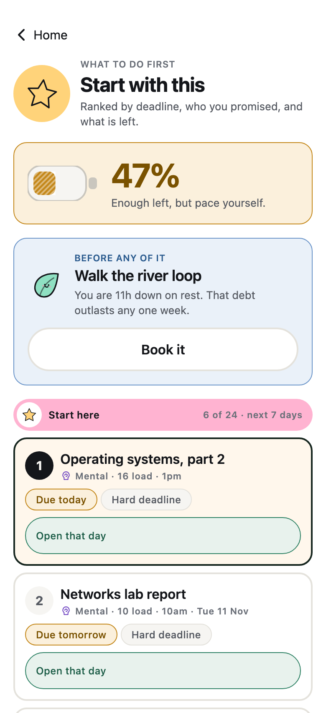
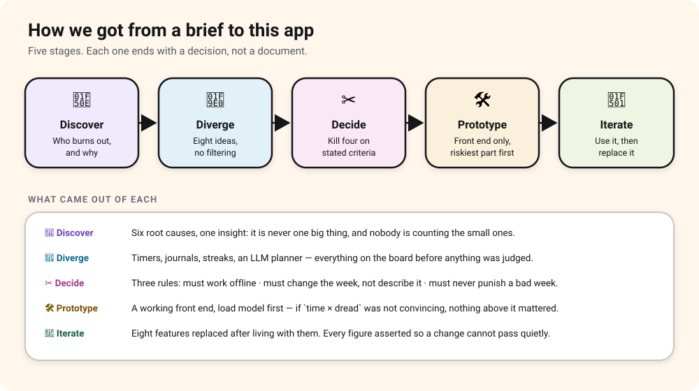
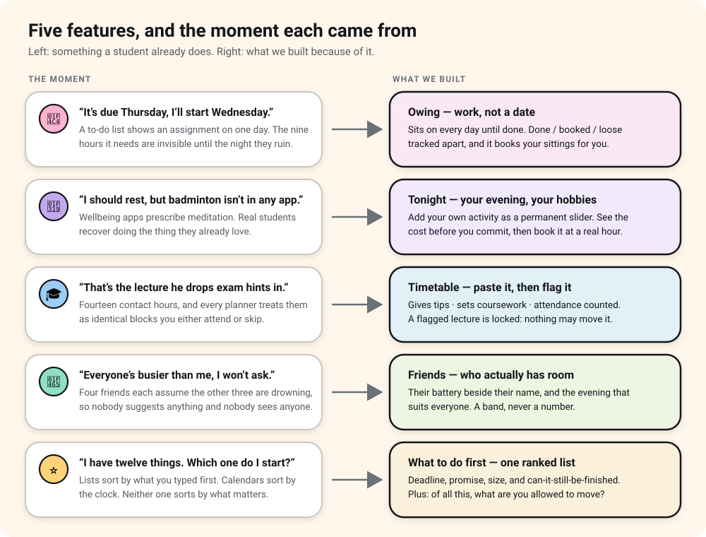
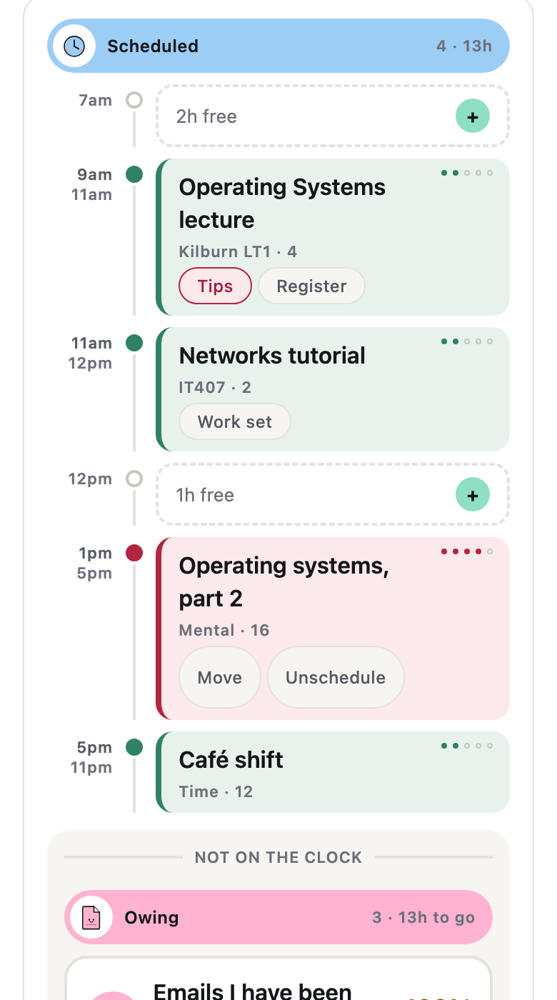
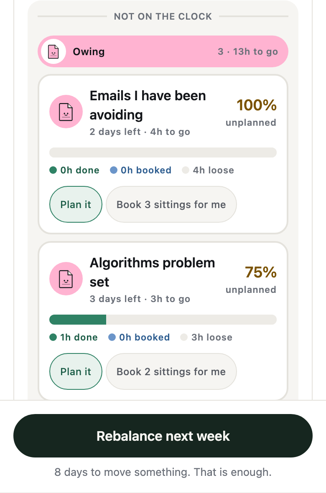
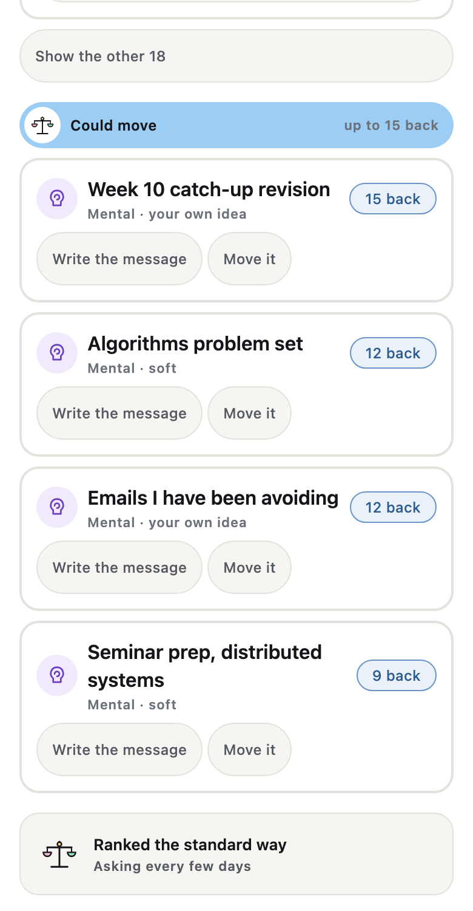
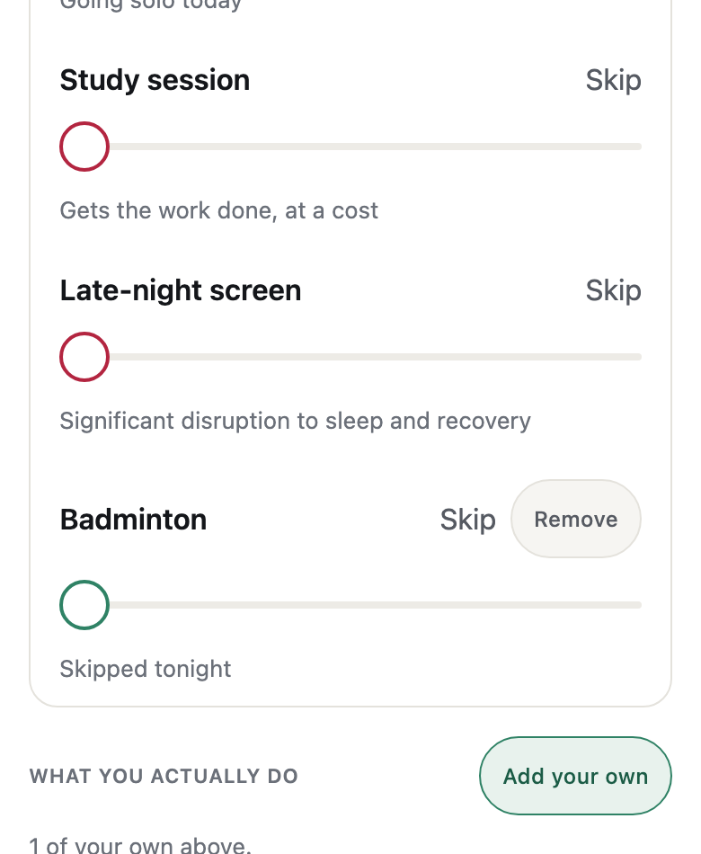
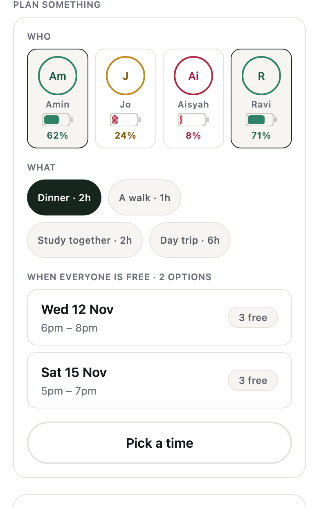

<h1 align="center">Ballast</h1>
<p align="center"><b>A stress and workload manager for students who are already too busy to manage their stress.</b></p>
<p align="center">
  <a href="https://load-balancer-ballast.expo.app"><b>▶ Open the live prototype</b></a> ·
  CodeNection · Lifestyle Track: Beating the Burnout
</p>

<p align="center">
  
  
  
</p>

---

## 1. Project Overview

### 🔥 The problem

Burnout is almost never one big thing. It is a pile of small ones nobody was counting — and by the time a
student can feel it, the week that caused it is already over.


### 🔍 What already exists, and where it stops

| App | Good at | Why it doesn't solve this |
|---|---|---|
| **Forest** | A charming Pomodoro timer | Treats distraction as the problem. A student drowning in coursework isn't distracted — they're overcommitted. |
| **Study Bunny** | Timer, coins, a rabbit you dress up | Rewards time *spent studying*. It can't tell you that studying more tonight is the wrong move. |
| **Notion · Todoist · Calendar** | Lists and blocks of time | Every task weighs the same. A full calendar looks identical to a survivable one. |
| **Mood journals** | Noticing a pattern | They describe the week. They change nothing about it. |

> Not one of them can say: **"Next Wednesday is going to hurt, and here are three things you could put down."**
> That sentence is the whole product.

### 💡 Our solution

**`load = time × dread`** — because an hour you're dreading costs more than an hour you're not.

One task lands in **several of five areas at once**: a group presentation isn't just "mental", it's mental
*and* time *and* a social cost nobody would have thought to name. So Ballast sees **which part of you** is
overflowing, not just how full you are.

Then it looks fourteen days ahead, finds the pile-up **before** it lands, and offers specific things you
could put down — including writing the awkward message for you.

🔌 Runs entirely on the phone. 👆 The daily ask is one tap.

---

## 2. Ideation & Process

### 2.1 🧭 The shape of the process



We ran it in five stages, and each one ended with a decision rather than a document.

**🔎 Discover.** We started from the symptom everyone recognises — *"I'm exhausted and I don't know why"* —
and worked down to what causes it. Six root causes, and one insight that shaped everything after it:
**burnout is never one big thing, and nobody is counting the small ones.**

**🧠 Diverge.** Everything on the board before anything was judged: timers, journals, streaks, an
AI planner, a battery metaphor, a dread multiplier.

**✂️ Decide.** We wrote the kill criteria *first*, then applied them:

| Rule | What it killed |
|---|---|
| Must work **offline** | The LLM-planned schedule |
| Must **change** the week, not describe it | The mood journal as a product |
| Must **never punish a bad week** | Streaks, badges, leaderboards |
| Must solve **overcommitment**, not distraction | The Pomodoro timer |

**🛠️ Prototype.** A working front end — no backend, no accounts, nothing to configure. The load model
came first, because if `time × dread` wasn't convincing, nothing on top of it would matter. Then capture,
then the forecast, then everything that acts on it.

**🔁 Iterate.** Then we used it for a fortnight — and replaced eight things (§2.4).

### 2.2 🧠 Eight ideas, four survived

Four are in the app. We killed four on purpose, and the reasons mattered more than the ideas did.


### 2.3 ✨ Where each headline feature came from

We didn't start from a feature list. Each one came from a specific moment we'd all had.



### 2.4 🔁 What we changed *after* building it

The honest half of the process. Every row below is something we shipped, used, and then replaced.

| # | We had | We have | Why it changed |
|---|---|---|---|
| 1 | One bucket per task | **Five dials per task** | Filing a group presentation under "mental" is how a week reads 60% while the person is finished. |
| 2 | Capture on one long scroll | **Four pages, one question each** | Everything on screen at once sounds efficient and reads as homework. |
| 3 | *"I'm about 40% done"* slider | **Tick each sitting off** | You know you did the two hours you booked. You don't know you're 40% through. |
| 4 | A 14-hour block labelled "timetable" | **Eight real classes, flaggable** | The biggest thing in a student's week was invisible on the screen meant to show their week. |
| 5 | Rest measured in hours slept | **Rest as a credit you're owed** | An absence isn't a number. A debt is. |
| 6 | Five fixed evening activities | **Add your own hobby** | The five we shipped were a guess about someone else's life. |
| 7 | Two illustration styles | **One sticker set** | Two visual voices on one app reads as an accident. |
| 8 | A battery pinned at 13% | **An ordinary week reads 47%** | There's no advice at 13% that differs from the advice at 4%. |

### 2.5 🔄 How it is actually used

Set up once, a small loop every day, and a bigger loop only when a bad week is on the way. Every box is a
screen you can open in the prototype right now.


### 2.6 👤 Mentor consultation

| Date | Mentor | Feedback received | What we changed |
|---|---|---|---|
| | | | |
| | | | |

> *To be completed by the team from our own mentor sessions.*

---

## 3. Design & Prototype

### ▶ [load-balancer-ballast.expo.app](https://load-balancer-ballast.expo.app) — live · no install · no sign-in

Every figure on every screen is computed from a seeded fictional semester. Nothing here is a mock-up —
change a task and the forecast changes with it.

---

### 3.1 ✍️ Add anything — five dials, four short pages

<table><tr><td width="42%">

</td><td>

Capture is where every planner loses people, because it looks like a form. Ours is **four pages, one
question each.**

- 🎨 **Start from a drawing.** Tap *Assignment*, *Shift*, *Gym* — the page fills itself in.
- 🎚️ **Five dials, not one number.** Say what it takes out of your head, hours, body, social life and
  admin, by dragging a face that gets more overwhelmed as you push it.
- ➗ **The maths stays honest.** Still `hours × dread`, where dread is the **worst** area, not the sum.
- 📉 **Spreading a load reads lower, correctly** — the worst area counts for **double its share**.
- 🙂 **Nobody learns a scale.** You can read the faces without reading the labels.

</td></tr><tr><td>

</td><td>

**Page four shows the damage before you agree to it.** Pick a day and an hour from the gaps that actually
exist in your week, and the battery underneath updates to what your week *will* read if you add this.
Nothing is saved until you press the button.

</td></tr></table>

---

### 3.2 📄 Owing — assignments that stop hiding until the night before

<table><tr><td width="42%">

</td><td>

A deadline is not a task. An assignment due Thursday is nine hours spread across the days *before* it —
and a normal list shows you nothing until Thursday, which is why it ruins the night before.

So a day splits into **three honest bands**:

| | |
|---|---|
| 🕐 **Scheduled** | Things with a time, on a clock rail |
| 📄 **Owing** | Work due later. Sits on **every** day until done |
| 🧺 **This day** | Loose tasks with no time yet |

</td></tr><tr><td>

</td><td>

Each Owing card carries a **three-state bar** — green is done, blue is booked, grey is still loose.

- ✅ **Progress is sittings ticked off, not a percentage guessed.** **Done** moves exactly its hours onto
  the bar — you know you did the two hours you booked; you don't know you're 40% through.
- 🗂️ **Sittings fold away** behind *Sittings · 1/3 done*.
- 📝 **Each takes a note** — *"finish section 2"* — which becomes the record of what you did.
- 🚨 **It warns before it's too late:** *"Not enough free time left. Something has to move."*
- ⏭️ **Push today's sitting to tomorrow** in one tap. The work moves; **the deadline never does.**

</td></tr></table>

> ### 📌 "Book my sittings for me"
>
> The part we're proudest of. It reads your **real** week — classes, shifts, recovery — and spreads the
> hours you owe across the **lightest days before the deadline**: two hours at a time, one sitting a day,
> never on top of something else, never before your own hour.
>
> It shows what it's about to do **first**, including what it *can't* fit — *"3h will not fit before the
> deadline."* Most planners let you discover that on Wednesday night.
>
> A real algorithm, not a language model — which is why it works on the bus with no signal.
> [Why →](#54--why-the-planner-is-an-algorithm-not-an-llm)

---

### 3.3 ⭐ What to do first — the question a list never answers

<table><tr><td width="42%">

</td><td>

Lists sort by what you typed first; calendars sort by the clock. Neither knows a two-hour job due
tomorrow beats a nine-hour job due next week. Everything in the next seven days goes on **one scale**.

| What counts | How much |
|---|---|
| **Size** | Hours still owed, or its load |
| **Deadline** | Today is **×3**; past a week, **below ×1** |
| **Who you promised** | hard > soft > yourself |
| **Can it still be finished?** | If not — **straight to the top** |

- 6️⃣ **Six at a time**, rest behind a tap.
- 🔘 **Every row has a button that does the next thing.**
- 🌿 **In rest debt, rest goes above all of it.**

</td></tr><tr><td>

</td><td>

**Then the half nobody asks: what are you *allowed* to move?**

The same ranking turned around — sorted by what each one gives you back, with a button to write the
message or move it to another day.

🔒 **Hard deadlines never appear here**, nor does the lecture you flagged for exam hints. The app will not
offer you something it would then refuse to do.

</td></tr></table>

---

### 3.4 🎓 Timetable — paste it, then mark the lectures that matter more

<table><tr><td width="42%">

</td><td>

Fourteen hours of class is the biggest single thing in a student's week, and most planners either ignore
it or make you type it twice.

- 📋 **Paste it from your portal.** Any shape works — `Mon 09:00-11:00 CS2040 … Kilburn LT1`.
  **A line it can't read is handed back, never dropped.**
- ⚠️ *"One more absence takes you under 80%."* Modules with no policy claim nothing.
- 🔗 **"View these in my week"** opens that day in Plan, so you see what flagging actually did.

| Flag | What it changes |
|---|---|
| 💡 **Gives exam tips** | The rebalancer will never move it — **locked** |
| 📝 **Sets coursework** | Adds *"Anything set in this one?"* |
| ✅ **Attendance counted** | Warns you **before** you cross the line |

</td></tr><tr><td>

</td><td>

**Dread belongs to the module, not the class.** You don't dread Tuesday — you dread networks. Set it once
and **every class in that module re-prices**, which is the only way to get an honest number without asking
you to rate fourteen contact hours one at a time.

Each module shows what it is costing you: *Networks · 5h · 10 load · 92% attended.*

</td></tr></table>

---

### 3.5 🌙 Tonight — an evening built around what *you* actually do

<table><tr><td width="42%">

</td><td>

Every other screen reports what happened. This is the day you haven't lived yet.
**Which night → what you'd do → book it.**

- 🌗 **Pick a kind of night, not a dial.** *A recovery night* and *push through* show their cost first.
- 🎚️ **Then adjust anything** — sleep, a walk, texting a friend, study, screen time.
- 🛏️ **Sleep says *when*, not just how long.** *"Tonight runs to 11pm, so 6h is not available."*
- 🕔 **Your evening starts when you say.** Nothing is booked before that hour.
- 🔐 **Booking writes real protected blocks**, at hours you can change — and never two at once.

</td></tr><tr><td>

</td><td>

🏸 **And you add your own.** Badminton, a night run, choir, band practice — type it once with a usual
length and it becomes a **permanent slider on your own screen**, counted like everything else.

The five we ship are a starting point, not a claim about your life. Amira plays badminton, so her Tonight
screen has a badminton slider.

</td></tr></table>

---

### 3.6 👥 Friends — see who has room before you ask

<table><tr><td width="42%">

</td><td>

People stop seeing friends in week 10 for want of **coordination**, not motivation — four people all
assuming everyone else is busier.

- 💗 **Quiet care, no nagging.** *"Aisyah has been heavy for 11 days"* — one line, no script.
- ✉️ **A low-effort reconnection** for whoever you haven't spoken to longest, because a two-line text is a
  realistic ask in a heavy week and a coffee is not.
- 🔒 **Privacy by design.** Friends see a **band** — steady, busy, heavy. Never your numbers.

</td></tr><tr><td>

</td><td>

📆 **And it does the coordinating.** Pick who and what — dinner, a walk, study together, a day trip — and
it intersects **their** free evenings with the real gaps in **your** week, then offers only the windows
that work for everybody. *Wed 12 Nov, 6–8pm. Sat 15 Nov, 5–7pm.*

🔋 **Everyone's battery sits next to their name**, because inviting the person at 8% to a day trip is not
a kindness. Sending it books it — in your week, as social load, with a real time on it.

</td></tr></table>

---

### 3.7 🔋 The battery, and the five areas under it

<table><tr><td width="42%">

</td><td>

One number is easy to read and easy to be wrong about. Ballast shows one, with a face — then what it's
made of.

- 🖐️ **Five areas, five separate ceilings.** 60% overall with mental at 100% is closer to the edge than an
  even 75%, and the maths says so.
- 😊 **The character never scolds.** No frown at any level. At 8% it's a companion who is also tired.
- 🧩 **Each area logs its own thing** — a mood grid, a week grid, meals and sleep, contact gaps, errands.
- 🎉 **The one input that puts charge back.** *Properly laughed*, *finished something*, *actually rested* —
  and the battery goes **up**. Repeats tail off, so it stays honest.

</td></tr></table>

---

### 3.8 ⚖️ Plan · Rebalance · Saying no — the part that prevents something

<table><tr><td width="42%">

</td><td>

**Plan** slides a 72-hour window across the fortnight and flags **density, not volume** — four things in
three days is a wall however light the average looks. It warns **eight days out**: long enough to email a
tutor or swap a shift.

**Rebalance** then prices what you could put down. Every row says what it saves and which hour it touches,
and the battery moves as you toggle. 🔒 **Hard deadlines can't be toggled at all.** Apply, and it says
whether the wall is actually gone.

</td></tr><tr><td>

</td><td>

**Saying no** is the twist. Knowing what to cut was never the hard part — *writing the message* is, which
is why it waits four days. So the app writes it, in three tones, and you edit it first.

✉️ **It never sends anything.** And *"Actually, I'm going"* is a first-class button that re-plans the week
around your choice instead of guilt-tripping you.

</td></tr></table>

---

### 3.9 The rest of it

<p align="center">
  
  
  
  
  
</p>
<p align="center">
  
  
  
  
  
</p>
<p align="center"><i>Intro · recovery ledger · matched rest · mood · body · errands · timetable import · booking a night · calm mode · lock screen</i></p>

---

## 4. What Makes It Different

| # | Feature | Why nothing else does this |
|---|---|---|
| 1 | ➗ **load = hours × dread** | No planner weighs a task by how much you mind it. 3h of group presentation (12) outweighs 6h of reading you enjoy (6). |
| 2 | 🎚️ **One task, five areas** | Everyone else files a task under one heading. We ask what it takes from each of the five — so it lands where it actually costs you. |
| 3 | 📄 **Work that is *owing*, not work that is today** | Assignments sit on every day until done; done / booked / loose tracked apart; sittings planned across your lightest days automatically. |
| 4 | ⭐ **One ranked answer to "what first?"** | Deadline, promise, size, and whether it can still be finished — one scale, a reason on every row. Plus: what are you *allowed* to move? |
| 5 | 🧱 **Clustering, not totals** | Everyone warns on volume. We slide a 72-hour window and flag **density**, eight days early. |
| 6 | ✉️ **The decline drafter** | It doesn't just say what to cut — it writes the message, in three tones, and never sends it. |
| 7 | 🌿 **Recovery in the same units as work** | Rest is a credit you're owed, in hours, carried forward. Booking it writes protected time in a gap that really exists. |
| 8 | 👥 **Your friends' *capacity*, not their calendar** | A band, never a number — and the evening that suits everyone. Nothing else tells you who has room before you ask. |
| 9 | 💡 **Classes marked for *why* they matter** | A lecture is just an hour until it's the one giving exam hints. Flag it and the rebalancer refuses to move it, visibly. |
| 10 | 🧘 **The interface gets simpler as the week gets worse** | Past the calm line it collapses to one number, one sentence, one button. Most apps add urgency when things get bad — that's backwards. |
| 11 | 🎮 **Game feel without game pressure** | A character, a drawing on every screen, a face on every dial — and no streak, no score, no leaderboard. |
| 12 | ♿ **Built for the worst day, not the demo day** | Every band is a colour **and** a word **and** a fill pattern, so nothing depends on colour alone. Every chart has a spoken sentence. 44pt targets, 200% dynamic type, reduced motion — nothing truncates. |

---

## 5. Technical Architecture & Feasibility

### 5.1 🛠️ What runs today

A complete, working front end. No screen is a mock-up; every figure is computed.

| Layer | Choice | Why |
|---|---|---|
| **App** | Expo SDK 57 · React Native 0.86 · React 19.2 | One codebase for iOS, Android and web. Opens from a QR code or a link. |
| **Language** | TypeScript 6, `strict` | Area, dread and commitment are union types — an impossible week doesn't compile. |
| **Routing** | Expo Router 57 | File-based, so the route tree *is* the screen list. Broken links fail at compile time. |
| **Styling** | NativeWind 4 + Tailwind 3.4 | Tailwind classes in React Native. The theme is generated from one design-token file, so a colour is defined once and used everywhere. |
| **State** | Zustand 5 | Small, local, synchronous. No provider tree, no cache layer. |
| **Charts** | Hand-built on `react-native-svg` | **Deliberately not a chart library.** Ours are real shapes carrying a fill pattern for colour-blind users and a spoken sentence for screen readers. |
| **Storage** | AsyncStorage, on device | Works in a basement lecture theatre. *Trade-off: no sync yet — §5.2.* |
| **Hosting** | EAS Hosting | `npm run deploy` runs the full check suite first and refuses to publish on a failure. |

### 5.2 🏗️ How we'd build the real thing

Local-first on purpose, all the way into production: **the phone stays the source of truth, the server is
a synchroniser — never a dependency.**

This is the destination. §5.3 is the first three weeks of it.

| Layer | Choice for v1 | What it's for |
|---|---|---|
| **API** | **Node.js + Express**, in TypeScript | The same language as the app, so the load model is written once and shared. A REST API every developer can read. |
| **Database** | **PostgreSQL** + **Prisma** | Relational, because a week genuinely is relational. Prisma gives typed queries and versioned migrations. |
| **Auth** | **Firebase Authentication** | Google, Apple and email sign-in out of the box. No passwords to store, and Apple sign-in is required for the App Store anyway. |
| **Notifications** | **Firebase Cloud Messaging** | One message, eight days out, only for a genuine collision. Nothing at 11pm. |
| **Jobs & cache** | **Redis** + a nightly cron worker | Runs the clustering detector server-side once a day, and rate-limits push. |
| **Sync** | Local-first queue · last-write-wins per row | Writes land on the phone immediately and drain when there's signal. Per-row, so two devices editing different tasks never collide. |
| **Friends** | A read-only `friend_view` — **band only** | Steady / busy / heavy, plus coarse free windows. Never your numbers, tasks or calendar. Per-friend and revocable. |
| **Timetable** | **Google Calendar API** + **ICS** subscription | Most portals publish an ICS URL, so the timetable updates itself. **Paste stays as the fallback that always works.** |
| **Health** | **Apple HealthKit** / **Google Health Connect** | Sleep and steps stop being seeded. Read-only, on device; only the derived load ever syncs. |
| **Optional AI** | **OpenAI API** (or Claude), two narrow jobs | Rewriting a decline message, and reading a messy sentence typed at 1am. **Opt-in, server-side, never on the critical path.** |
| **Hosting** | **Docker** on **AWS** — ECS for the API, RDS for Postgres, S3 for files | Standard, well-documented, and cheap at this size. **Railway** or **Render** for the first month if we want to move faster. |
| **CI/CD** | **GitHub Actions** → **Expo EAS Build** → TestFlight / Play internal | The four checks in §5.5 gate every merge. |
| **Monitoring** | **Sentry** (crashes) + **Google Analytics for Firebase** | No personal data, no task text, no ad SDKs. |
| **Compliance** | GDPR export + delete, data minimisation | A **workload tool, not a clinical one**. No diagnosis, no score — and we say so on screen. |

```
┌──────────────── phone ───────────────┐        ┌───────── Node.js + Express API ─────────┐
│  Expo app (iOS · Android · Web)      │  REST  │  ├─ Prisma → PostgreSQL (AWS RDS)       │
│  ├─ Zustand  ← source of truth       │ ◀────▶ │  ├─ Redis — cache + job queue           │
│  ├─ AsyncStorage (offline)           │  sync  │  └─ nightly cron: clustering detector   │
│  ├─ load model + scheduler (local)   │  queue └─────────────────────────────────────────┘
│  └─ HealthKit / Health Connect       │              │                    │
└──────────────────────────────────────┘              ▼                    ▼
        │                                    Firebase Auth        Firebase Cloud
        │ Google Calendar / ICS              (Google · Apple)        Messaging
        ▼                                                                │
  University timetable feed                                              ▼
                                                            one push, 8 days out
```

> **The rule we won't break:** capture, the load model, the forecast, rebalancing, recovery and the planner
> must all keep working with the network off. The server adds sync, friends and notifications — it is never
> required to use the app.

### 5.3 📅 Three weeks, if we go ahead

**Already done:** the entire front end — load model, capture, forecast, rebalance, drafter, recovery,
Tonight, five areas, timetable, owing work, priority, accessibility. Live now, with 351 render and 313
behaviour assertions passing on every deploy.

We have **three weeks** of build time after the finals. That is not enough for everything in §5.2, so the
plan is a scope decision rather than a wish list: **one vertical slice, finished**, instead of five things
half-done.

**What we build:** accounts and sync. Nothing else. It is the only item the app genuinely cannot fake —
every other feature already works offline, on the phone, today.

| Week | Focus | Ships | Done when |
|---|---|---|---|
| **1** | 🗄️ **Data layer** | Express API in TypeScript, Postgres schema via Prisma, Firebase Auth (Google · Apple · email), `/sync` endpoint | A signed-in account can push and pull a week over HTTPS, and cannot read anyone else's |
| **2** | 🔄 **Sync in the app** | Local-first write queue, pull-on-open, per-row conflict resolution, GDPR export and delete | A task added on a phone in aeroplane mode appears on the web after reconnecting — **and on no other account** |
| **3** | 🚀 **Ship it** | Deploy to Railway, GitHub Actions running the four checks on every push, Sentry, TestFlight build, bug-fix buffer | Five testers install from TestFlight, use it for three days, and nothing is lost |

**Why this order.** Week 3 is deliberately half buffer. A three-week estimate with no slack is a two-week
estimate with a bad ending, and the checks in §5.5 only protect us if they are actually wired into CI.

**Cut on purpose, and honest about it:** friends syncing between real accounts, push notifications, the ICS
timetable feed, and health data. Each needs the data layer underneath it, so they are the natural week 4–8
and not something we will pretend to fit into three.

**What that means for the demo:** nothing changes. Everything you can open today keeps working exactly as
it does — the three weeks add sync *behind* it, not features on top.

**Risks we already know about**

| Risk | How we handle it |
|---|---|
| Students stop logging after a week | The daily ask is **one tap**, and the app stays correct after a fortnight of silence. Timetable and repeating commitments are entered once, counted forever. |
| Ceilings are guesses at first | They **recalibrate** — report two hard days below your line and the line comes down to meet you. |
| Friend features feel like surveillance | Band only. Per-friend, revocable, enforced in the database. |
| University portals vary wildly | ICS first, paste always. The parser hands back any line it can't read rather than guessing. |
| Anything resembling medical advice | No diagnosis, no clinical language, no score — stated in the app. |

### 5.4 🤖 Why the planner is an algorithm, not an LLM

We tried the LLM version first. Three things killed it: a demo can't depend on venue wifi, a student on a
bus has no signal either, and — the decider — **we couldn't explain what it would do.**

The rule-based version is a genuine scheduler: reads your real week, walks the days before a deadline
lightest-first, places sittings in gaps that exist, never doubles up, never books before your own hour, and
says up front what it can't fit. Deterministic, testable, instant — which is why we can assert its output
in CI.

An LLM returns later for the two jobs where taste beats arithmetic: rewriting a decline message, and
reading a messy sentence typed at 1am. Both optional, both with the rule-based path underneath.

### 5.5 ✅ How we know it works

No manual clicking. Four checks run before anything deploys, and `npm run deploy` refuses to publish if any
of them fail.

| Check | What it proves |
|---|---|
| `model:check` | **20** figures — the study's loads, and the calibration we set |
| `behaviour:check` | **313** state changes — every button moves the state it claims to |
| `render:check` | **351** strings across **27 pages**, and every screen has a way out |
| `tokens:check` | **90** design tokens consistent across the whole app |
